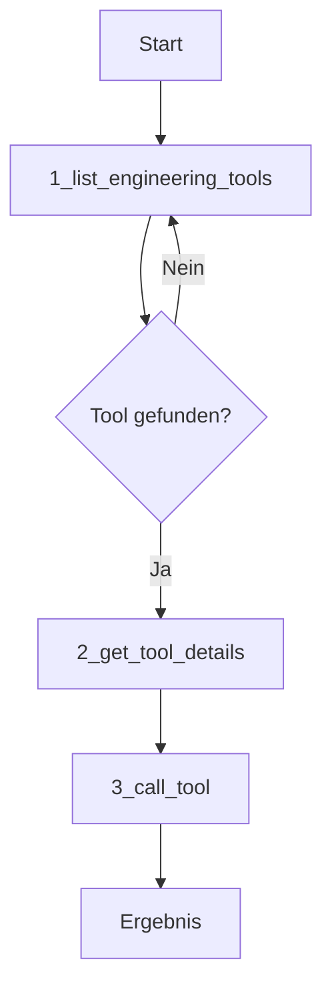

# MCP Engineering Server - Gesamtdokumentation

**Version:** 2.0  
**Stand:** Januar 2025  
**Status:** Produktionsreif - 26 Tools aktiv

## Inhaltsverzeichnis

1. [Übersicht](#übersicht)
2. [Architektur-Konzept](#architektur-konzept)
3. [Tool-System](#tool-system)
4. [Parameter-System](#parameter-system)
5. [Discovery-Workflow](#discovery-workflow)
6. [Tool-Implementierung](#tool-implementierung)
7. [Metadaten-Struktur](#metadaten-struktur)
8. [Deployment](#deployment)
9. [Anhang](#anhang)

---

## Übersicht

Der MCP Engineering Server ist ein modularer Server für Ingenieurberechnungen mit einer **3-stufigen Discovery-Architektur**. Das System trennt Meta-Tools (Discovery) von Engineering-Tools (Execution) und nutzt ein **TARGET-basiertes Parameter-System** für flexible Berechnungen.

### Kernmerkmale

- **26 aktive Tools**: 4 Meta-Tools + 22 Engineering-Tools
- **3-stufiger Discovery-Workflow**: Progressive Tool-Erkundung
- **TARGET-System**: Alle Parameter Pflicht, einer als 'target'
- **Batch-Berechnungen**: Mehrere Parametersätze in einem Aufruf
- **Ultra-tolerante Eingabe**: Automatische LLM-Syntax-Korrektur
- **Unified Solving**: Symbolische und numerische Berechnungen
- **Tag-basierte Organisation**: Flexible Kategorisierung
- **Pint-Einheitensystem**: Automatische Einheiten-Konvertierung

### Aktueller Tool-Bestand

```
✅ 4 Meta-Tools (direkt verfügbar)
   • 1_list_engineering_tools
   • 2_get_tool_details
   • 3_call_tool
   • get_available_categories

✅ 22 Engineering-Tools (über call_tool)
   • 4 Schrauben-Tools
   • 7 Flächen-Tools (geometry)
   • 4 Umfang-Tools (geometry)
   • 6 Volumen-Tools (geometry)
   • 1 Druck-Tool (pressure)
```

---

## Architektur-Konzept

### 3-Stufen-Architektur

```
┌─────────────────────┐
│     LLM Client      │
└──────────┬──────────┘
           │ MCP Protocol
           ▼
┌─────────────────────┐
│   4 Meta-Tools      │ ← Stufe 1: Discovery & Gateway
├─────────────────────┤
│ • list_engineering  │
│ • get_tool_details  │
│ • call_tool         │
│ • get_categories    │
└──────────┬──────────┘
           │ Internal Registry
           ▼
┌─────────────────────┐
│ 22 Engineering-Tools│ ← Stufe 2: Execution
├─────────────────────┤
│ • Schrauben (4)     │
│ • Flaechen (7)      │
│ • Umfang (4)        │
│ • Volumen (6)       │
│ • Pressure (1)      │
└─────────────────────┘
           │ TARGET-System
           ▼
┌─────────────────────┐
│  Berechnungslogik   │ ← Stufe 3: Solving
├─────────────────────┤
│ • Symbolic (21)     │
│ • Numeric (0)       │
│ • Mixed (1)         │
└─────────────────────┘
```

### Tag-System

**Verfügbare Tags:**
- `meta`: Discovery und Workflow-Tools
- `elementar`: Grundlegende Berechnungen
- `Flaechen`: Flächenberechnungen
- `Umfang`: Umfangsberechnungen
- `Volumen`: Volumenberechnungen
- `schrauben`: Schrauben-Berechnungen
- `tabellenwerk`: Datenbank-Abfragen

### Verzeichnisstruktur

```
MCP_server_TEST/
├── server.py                    # Meta-Tools und MCP-Konfiguration
├── web.py                       # Railway-Entry-Point
├── engineering_mcp/
│   ├── registry.py             # Tool-Registry
│   └── units_utils.py          # Pint-Einheitensystem
├── tools/                      # Engineering-Tools
│   ├── pressure/               # Druckberechnungen
│   │   └── kesselformel.py    
│   ├── geometry/               # Geometrische Berechnungen
│   │   ├── Flaechen/          # 7 Tools
│   │   ├── Umfang/            # 4 Tools
│   │   └── Volumen/           # 6 Tools
│   └── Schrauben/             # 4 Tools
├── TOOL_TEMPLATE.py           # Verbindliches Tool-Template
└── requirements.txt           # Dependencies
```

---

## Tool-System

### Tool-Kategorien (Stand: Januar 2025)

#### Schrauben-Tools (4)
| Tool | Beschreibung | has_solving |
|------|--------------|-------------|
| durchgangsloecher_metrische_schrauben | Durchgangslöcher für M6-M150 | none |
| schrauben_datenbank | ISO-metrische Gewinde Datenbank | none |
| schrauben_info | Schrauben-Informationen | none |
| schrauben_suche_vorspannkraft | Vorspannkraft-Suche | none |

#### Geometrie: Flächen (7)
| Tool | Formel | Lösbare Variablen |
|------|--------|-------------------|
| kreis_flaeche | A = π × r² | area, radius |
| dreieck_flaeche | A = (1/2) × b × h | area, base, height |
| ellipse_flaeche | A = π × a × b | area, semi_major_axis, semi_minor_axis |
| parallelogramm_flaeche | A = b × h | area, base, height |
| rechteck_flaeche | A = l × w | area, length, width |
| kreisring_flaeche | A = π × (R² - r²) | area, outer_radius, inner_radius |
| trapez_flaeche | A = (1/2) × (a + c) × h | area, side_a, side_c, height |

#### Geometrie: Umfang (4)
| Tool | Formel | Lösbare Variablen |
|------|--------|-------------------|
| dreieck_umfang | P = a + b + c | perimeter, side_a, side_b, side_c |
| ellipse_umfang | Ramanujan-Näherung | perimeter, semi_major_axis, semi_minor_axis |
| kreis_umfang | P = 2 × π × r | perimeter, radius |
| rechteck_umfang | P = 2 × (l + w) | perimeter, length, width |

#### Geometrie: Volumen (6)
| Tool | Formel | Lösbare Variablen |
|------|--------|-------------------|
| kegel_volumen | V = (1/3) × π × r² × h | volume, radius, height |
| kugel_volumen | V = (4/3) × π × r³ | volume, radius |
| prisma_volumen | V = A × h | volume, base_area, height |
| pyramide_volumen | V = (1/3) × A × h | volume, base_area, height |
| quader_volumen | V = l × w × h | volume, length, width, height |
| zylinder_volumen | V = π × r² × h | volume, radius, height |

#### Druck-Tools (1)
| Tool | Formel | Lösbare Variablen |
|------|--------|-------------------|
| kesselformel | σ = (p × D) / (2 × s × v) | pressure, diameter, wall_thickness, allowable_stress |

---

## Parameter-System

### TARGET-System (Neu 2025)

**Prinzip:** Alle Parameter sind PFLICHT - einer als 'target', die anderen mit Einheiten.

```python
# ALT (deprecated):
solve_tool(param1=10, param2=None, param3=5)  # param2 wird berechnet

# NEU (aktuell):
solve_tool(param1="10 mm", param2="target", param3="5 cm")  # param2 wird berechnet
```

### Batch-Berechnungen (Neu 2025)

**Prinzip:** Mehrere Parametersätze in einem Aufruf berechnen - ALLE Parameter müssen Listen gleicher Länge sein!

```python
# Einzelberechnung (Standard):
result = solve_kreis(
    flaeche="target", 
    radius="5 cm", 
    durchmesser="10 cm"
)

# Batch-Berechnung (3 vollständige Parametersätze):
result = solve_kreis(
    flaeche=["target", "10 cm²", "target"],
    radius=["5 cm", "10 cm", "15 cm"], 
    durchmesser=["30 cm", "target", "45 cm"]
)
```

**Wichtige Regeln für Batch-Mode:**
- ⚠️ ALLE Parameter müssen Listen sein
- ⚠️ Alle Listen müssen die GLEICHE Länge haben
- Jeder Index repräsentiert einen vollständigen Parametersatz
- Jeder Parametersatz braucht genau einen 'target'
- Keine Begrenzung der Anzahl (unbegrenzte Batch-Größe)

**Batch-Rückgabe-Format:**
```python
{
    "batch_mode": True,
    "total_calculations": 3,
    "successful": 3,
    "failed": 0,
    "results": [
        {
            "batch_index": 0,
            "input_combination": {"flaeche": "target", "radius": "5 cm", "durchmesser": "30 cm"},
            "📊 ANALYTICAL SOLUTION": "Geschlossene Formel",
            "target_parameter": "flaeche",
            "ergebnis": {"flaeche": "78.5398 cm²"},
            ...
        },
        # Weitere Ergebnisse für Index 1 und 2
    ]
}
```

### has_solving Parameter

Ersetzt die alten Parameter `has_symbolic_solving` und `is_target_based`:

```python
"has_solving": "symbolic"           # Alle Parameter analytisch lösbar (21 Tools)
"has_solving": "numeric"            # Alle Parameter numerisch lösbar (0 Tools)
"has_solving": "symbolic/numeric"   # Gemischte Methoden (1 Tool: ellipse_umfang)
"has_solving": "none"               # Keine Berechnungen (4 Schrauben-Tools)
```

### Berechnungsart-Dokumentation

Für Tools mit `"has_solving": "symbolic/numeric"`:

```python
"target_parameters_info": {
    "perimeter": {
        "method": "symbolic",
        "description": "Analytisch lösbar durch Ramanujan-Näherungsformel",
        "accuracy": "Sehr hoch (Fehler < 5×10⁻⁵)"
    },
    "semi_major_axis": {
        "method": "numeric",
        "description": "Numerisch lösbar durch Bisection-Methode",
        "accuracy": "Toleranz 1×10⁻¹⁰"
    }
}
```

---

## Discovery-Workflow

### 3-Schritt-Workflow (Pflicht für LLMs)



### Schritt 1: Tools auflisten

```python
# IMMER mit tags=['all'] für Übersicht
tools = await list_engineering_tools(tags=['all'])

# ODER spezifische Kategorie
tools = await list_engineering_tools(tags=['Flaechen'])
```

### Schritt 2: Tool-Details abrufen (PFLICHT)

```python
# Vor JEDEM call_tool ausführen!
details = await get_tool_details(tool_name="kreis_flaeche")

# Liefert:
{
    "parameters": {
        "area": {"type": "string", "description": "..."},
        "radius": {"type": "string", "description": "..."}
    },
    "examples": [...],
    "has_solving": "symbolic"
}
```

### Schritt 3: Tool ausführen

```python
# Ultra-tolerante Eingabe - viele Formate funktionieren
result = await call_tool(
    tool_name="kreis_flaeche",
    parameters={"area": "target", "radius": "5 cm"}
)
```

### Ultra-tolerante Parameter-Eingabe

Der Server korrigiert automatisch:
- Python-Dict-Syntax: `{param="value"}` → `{"param": "value"}`
- Code-Fences: ````json {...} ```` → `{...}`
- Bool/None: `True/False/None` → `true/false/null`
- n8n-Workflow-JSON: Automatische Extraktion

---

## Tool-Implementierung

### Verbindliche Metadaten-Struktur (14 Pflichtfelder)

```python
# ===== 🎯 ALLE FELDER SIND PFLICHTFELDER =====
TOOL_NAME = "tool_name"
TOOL_TAGS = ["elementar", "Flaechen"]
TOOL_SHORT_DESCRIPTION = "Kurzbeschreibung - Was das Tool macht"
TOOL_VERSION = "1.0.0"
HAS_SOLVING = "symbolic"
TOOL_DESCRIPTION = """Erweiterte Beschreibung..."""

# Parameter-Definitionen (pro Parameter)
PARAMETER_NAME = {
    "type": "string",
    "description": "...",
    "example": "..."
}

OUTPUT_RESULT = {
    "type": "Quantity",
    "description": "Berechnungsergebnis mit optimierter Einheit",
    "unit": "abhängig vom Parameter"
}

TOOL_EXAMPLES = [...]
TOOL_ASSUMPTIONS = [...]
TOOL_LIMITATIONS = [...]
MATHEMATICAL_FOUNDATION = "..."
NORM_GRUNDLAGE = "..."  # Kann leer sein

# Automatisch berechnet
PARAMETER_COUNT = len([name for name in globals() if name.startswith('PARAMETER_')])
```

### TARGET-basierte Implementierung

```python
def solve_tool_name(
    param1: Annotated[str, "Beschreibung oder 'target' für Berechnung"],
    param2: Annotated[str, "Beschreibung oder 'target' für Berechnung"],
    param3: Annotated[str, "Beschreibung oder 'target' für Berechnung"]
) -> Dict:
    # 1. Target identifizieren
    target_params = []
    given_params = []
    
    # 2. Genau 1 target validieren
    if len(target_params) != 1:
        return {"error": "Genau ein Parameter muss 'target' sein"}
    
    # 3. Einheiten validieren
    params = validate_inputs_have_units(**validation_kwargs)
    
    # 4. Berechnung durchführen
    # ...
    
    # 5. Ergebnis mit Berechnungsart
    return {
        "target_parameter": target_param,
        "ergebnis": {...},
        "berechnungsart": "ANALYTISCHE LÖSUNG" | "NUMERISCHE ITERATION"
    }
```

---

## Metadaten-Struktur

### Finale Tool-Metadaten (14 Pflichtfelder)

| Gruppe | Felder | Beschreibung |
|--------|--------|--------------|
| **Grundlegende Info** | TOOL_NAME, TOOL_TAGS, TOOL_SHORT_DESCRIPTION, PARAMETER_COUNT, TOOL_VERSION, HAS_SOLVING, TOOL_DESCRIPTION | Tool-Identifikation und Beschreibung |
| **Parameter & Output** | PARAMETER_*, OUTPUT_RESULT | Ein- und Ausgabe-Definition |
| **Dokumentation** | TOOL_EXAMPLES, TOOL_ASSUMPTIONS, TOOL_LIMITATIONS, MATHEMATICAL_FOUNDATION, NORM_GRUNDLAGE | Verwendung und Grundlagen |

### Entfernte Felder
- ❌ REFERENCE_UNITS (nicht funktional genutzt)
- ❌ DATENGRUNDLAGE (in NORM_GRUNDLAGE integriert)  
- ❌ BESONDERHEIT (zu spezifisch)
- ❌ is_target_based (immer True, redundant)
- ❌ has_symbolic_solving (durch has_solving ersetzt)

---

## Deployment

### Lokal (Entwicklung)

```bash
# Installation
pip install -r requirements.txt

# Server starten
python server.py

# Output:
# ✅ 4 Meta-Tools direkt registriert
# ✅ 22 Engineering-Tools entdeckt
# 🎯 Server bereit: 26 Tools verfügbar
```

### Railway (Produktion)

```python
# web.py - Railway Entry-Point
if __name__ == "__main__":
    port = int(os.getenv("PORT", 8080))
    config = uvicorn.Config(
        app,
        host="0.0.0.0",
        port=port,
        log_level="info"
    )
```

### Umgebungsvariablen

```bash
SERVER_NAME=EngineersCalc    # MCP Server Name
DEBUG=false                  # Debug-Modus
PORT=8080                   # Server-Port
```

---

## Anhang

### A. Neue Tools hinzufügen

1. **Kopiere Template:**
   ```bash
   cp TOOL_TEMPLATE.py tools/geometry/Flaechen/neues_tool.py
   ```

2. **Implementiere nach Template:**
   - Alle 14 Metadaten-Felder ausfüllen
   - TARGET-System implementieren
   - Deutsche Parameter-Namen verwenden

3. **Server neu starten** - Tool wird automatisch entdeckt

### B. Best Practices

**Für Tool-Entwickler:**
- ✅ Verwende TOOL_TEMPLATE.py als Basis
- ✅ Alle 14 Metadaten-Felder sind Pflicht
- ✅ Deutsche Parameter-Namen verwenden
- ✅ Einheiten mit Pint validieren
- ✅ TARGET-System konsequent nutzen

**Für LLM-Integration:**
- ✅ IMMER 3-Schritt-Workflow befolgen
- ✅ get_tool_details vor jedem call_tool
- ✅ tags=['all'] für Übersicht nutzen
- ✅ Ultra-tolerante Eingabe nutzen
- ✅ Einheiten immer angeben

### C. Technische Details

**Dependencies:**
```
fastmcp>=2.5.1         # MCP Framework
pint>=0.23             # Einheitensystem
pydantic>=2.0          # Validierung
uvicorn[standard]      # ASGI Server
starlette              # Web Framework
```

**Performance:**
- Tool-Discovery: < 100ms
- Tool-Execution: < 500ms (symbolic)
- Tool-Execution: < 5s (numeric)
- Parallel-Verbindungen: 400+

### D. Changelog

**Version 2.1 (Januar 2025):**
- ✅ Batch-Berechnungen implementiert
- ✅ Vollständige Parametersätze erforderlich
- ✅ Unbegrenzte Batch-Größe
- ✅ Fehlertolerante Batch-Verarbeitung

**Version 2.0 (Januar 2025):**
- ✅ TARGET-System implementiert
- ✅ has_solving Parameter konsolidiert
- ✅ 14 Pflichtfelder für Metadaten
- ✅ Ultra-tolerante LLM-Eingabe
- ✅ 3-Schritt-Discovery-Workflow

**Version 1.0 (Dezember 2024):**
- Initial Release mit 22 Tools
- Tag-basierte Organisation
- Pint-Einheitensystem

---

## Zusammenfassung

Der MCP Engineering Server bietet eine **skalierbare, modulare Architektur** für Ingenieurberechnungen mit:

- **26 produktionsreife Tools** (4 Meta + 22 Engineering)
- **3-stufiger Discovery-Workflow** für optimale LLM-Integration
- **TARGET-System** für flexible Parameter-Berechnungen
- **Batch-Berechnungen** für Massenverarbeitung (unbegrenzte Anzahl)
- **Ultra-tolerante Eingabe** für robuste LLM-Kommunikation
- **Einheitliche Metadaten-Struktur** mit 14 Pflichtfeldern
- **Tag-basierte Organisation** für flexible Kategorisierung

Das System ist **produktionsreif** und läuft stabil mit allen aktuellen LLM-Clients. 